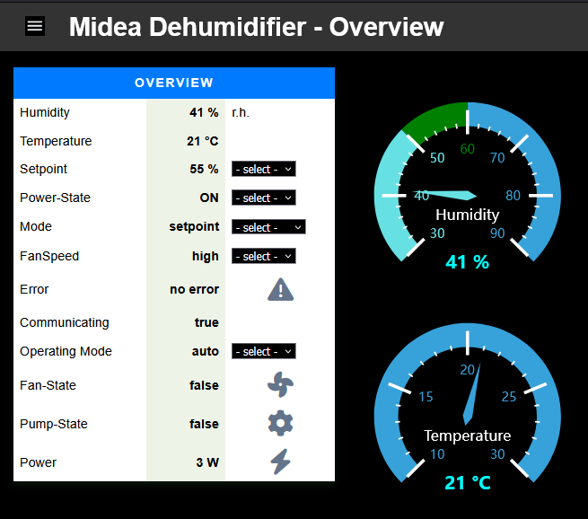
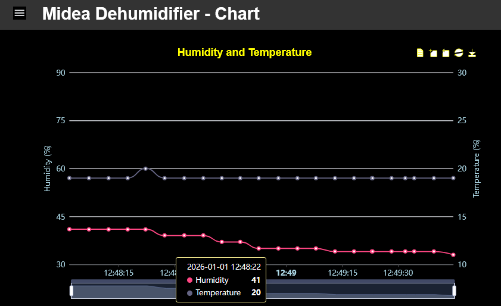

# Midea Dehumidifier Project

## 1. Introduction

The **Midea DF-20DEN7-WF** dehumidifier (identical to the **Comfee dehumidifier MDDF-20DEN7**) is normally connected to the cloud-based **Midea App** via a so-called **SmartKey dongle**.

This project follows an alternative approach and enables **cloud-free integration** of the device into **any smarthome system** via **MQTT** or a **REST API**.

The documentation describes both the required **hardware modification** and the **software** necessary to achieve this goal.

**Key aspects of the project:**

* The original SmartKey is replaced by an **ESP32 processor** flashed with **Tasmota** firmware
* Device control is implemented using the **Berry scripting language**

The C++ project [esp8266-midea-dehumidifier](https://github.com/Hypfer/esp8266-midea-dehumidifier) served as a reference.

In parallel with the development of this project, [ESPHome-Dehumidifier](https://github.com/Chreece/ESPHome-Dehumidifier) was created, offering a similar feature set.

---

## 2. Fundamentals

### 2.1 Serial Communication

Communication between the **SmartKey** and the **Midea controller** is performed via a serial interface with the following parameters:

* **Baud rate:** 9600
* **Data format:** 8N1
* **Signal levels:** 5 V TTL

Both control commands and status information are exchanged over this interface.
The most important supported parameters are summarized in the table below:

| Parameter     | Description                                    |
| ------------- | ---------------------------------------------- |
| Power         | On / Off                                       |
| Mode          | setpoint, continuous, smart, dryer             |
| Setpoint      | 35 … 85 % r. h. in 5 % steps                   |
| Fan Speed     | low, medium, high                              |
| Temperature   | Current temperature in °C                      |
| Humidity      | Current relative humidity in % r. h.           |
| Error         | Current error code                             |
| Communicating | Communication status (TRUE = communication OK) |

---

## 3. SmartKey Hardware Replacement

The following hardware components are used to replace the original SmartKey dongle:

* ESP32-S3
* 4-channel level shifter (3.3 V ↔ 5.0 V)
* Cut USB-A cable
* USB-A extension cable
* Wago terminals
* Jumper wires
* Double-sided adhesive tape
* Enclosure

The **ESP32-S3** provides sufficient RAM to use additional tools such as
[TasmoView](https://github.com/wjohn007/TasmoView).

Since the dehumidifier’s serial interface operates with **5 V TTL levels**, a **4-channel level shifter** is used to adapt the **3.3 V signals** of the ESP32. It is mounted directly on the ESP32 in a space-saving and electrically insulated manner.

The **Wago terminals** are also mounted directly on the ESP32 and provide a mechanically stable connection between the cut USB cable and the electronics.

The USB socket of the dehumidifier provides the signals **GND, VCC, RX, and TX**, with **VCC = 5 V DC**.
The ESP32 therefore acts both as the **control unit** and as a mechanical **“motherboard”** for the level shifter and terminals.

<br>
This allows everything to fit into a standard small junction box.

<br>
Electronic schematic of the Tasmota controller with all components.

<br>
The SmartKey is removed and the USB extension cable is installed.

<br>
The USB extension is routed out of the housing and connected to the Tasmota controller.

<br>
Completed wiring to the dehumidifier.

---

## 4. Tasmota Firmware

For the requirements of this project, the **standard Tasmota firmware for the ESP32-S3** is fully sufficient.

**Recommended firmware (without PSRAM support):**

* [tasmota32s3 without PSRAM support](https://ota.tasmota.com/tasmota32/release/tasmota32s3.bin)

If additional RAM is required (e.g. for more complex scripts or visualization tools such as TasmoView), a firmware version with **PSRAM support** can be used instead:

**Alternative firmware (with PSRAM support):**

* [tasmota32s3 with PSRAM support](https://github.com/Jason2866/Tasmota-specials/raw/refs/heads/firmware/firmware/tasmota32/other/tasmota32s3-qio_opi.bin)

---

## 5. Application Software

The application logic is implemented using the **Berry scripting language**.
The complete source code is bundled in the **application file `dehum.tapp`**.

### 5.1 Basic Functions

* Implementation of the **native communication protocol** of the Midea controller
* Provision of **new Tasmota commands**
* Integration of device information into the **Tasmota sensor message**
* Display of relevant information in the **Tasmota web UI**

### 5.2 Extended Function Mode (Extended Mode)

* Acquisition of **electrical power consumption** via a **SmartPlug**
* Derivation of internal operating states:

  * Fan **ON / OFF**
  * Pump **ON / OFF**
* Integration of extended information into the **Tasmota sensor message**
* Display of the information in the **Tasmota web UI**
* Visualization of the data in **TasmoView**

---

## 6. Extended Mode System Overview

The following diagram shows the **system architecture of the Extended Mode**.

* A **SmartPlug (3)** is used to measure the **electrical power consumption** of the dehumidifier.
* Based on the measured power, the following internal operating states can be **derived indirectly**:

  * **Fan active** if power ≥ **15 W**
  * **Pump active** if power ≥ **100 W**

<br>

Communication between the **Dehum Controller (2)** and the **SmartPlug (3)** is performed via the
[Udp-Broker](https://github.com/wjohn007/Berry-UdpBroker).

---

## 7. Configuration

The application is configured using the file **`dehum01.be`**.

### 7.1 Serial Interface

```py
GPIO_RX = 14   # GPIO for serial RX pin
GPIO_TX = 13   # GPIO for serial TX pin
```

### 7.2 Extended Mode

```py
useExtension = true  # true = enable Extended Mode
```

---

## 8. Tasmota Commands

The application provides additional **Tasmota commands** for controlling the dehumidifier.

| Command      | Arguments                                  | Example             |
| ------------ | ------------------------------------------ | ------------------- |
| `dhfanSpeed` | `low`, `medium`, `high`                    | `dhfanSpeed medium` |
| `dhmode`     | `setpoint`, `continuous`, `smart`, `dryer` | `dhmode setpoint`   |
| `dhpower`    | `on`, `off`                                | `dhpower on`        |
| `dhsetpoint` | `35 … 85` in steps of 5                    | `dhsetpoint 55`     |

---

## 9. Sensor Message

### 9.1 Normal Mode

```json
{
  "Time": "2025-12-07T18:34:35",
  "Dehumidifier": {
    "errorString": "no error",
    "communicating": true,
    "operatingmode": "auto",
    "fanspeed": "high",
    "humidity": 56,
    "power": "ON",
    "temperature": 20,
    "setpoint": 55,
    "errorcode": "0",
    "mode": "setpoint"
  }
}
```

### 9.2 Extended Mode

```json
{
  "Time": "2026-01-01T16:41:56",
  "Dehumidifier": {
    "errorString": "no error",
    "communicating": true,
    "operatingmode": "auto",
    "fanspeed": "high",
    "humidity": 42,
    "power": "ON",
    "temperature": 20,
    "setpoint": 55,
    "errorcode": "0",
    "mode": "setpoint"
  },
  "EXTENSION": {
    "FAN_STATE": false,
    "PUMP_STATE": false,
    "Power": 2
  }
}
```

---

## 10. Tasmota Web UI

### Default Mode

<br>

### Extended Mode

<br>

### TasmoView

<br>

<p></p>
<br>

---

## 11. References

* [esp8266-midea-dehumidifier](https://github.com/Hypfer/esp8266-midea-dehumidifier)
* [ESPHome-Dehumidifier](https://github.com/Chreece/ESPHome-Dehumidifier)
* [TasmoView](https://github.com/wjohn007/TasmoView)
* [Berry-UdpBroker](https://github.com/wjohn007/Berry-UdpBroker)

---


