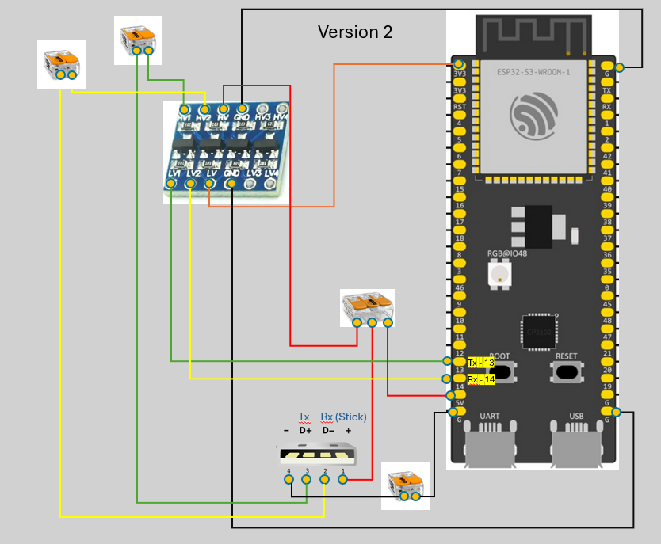
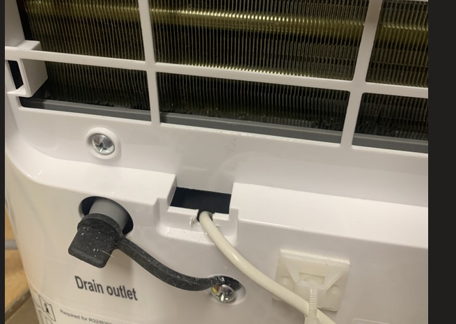
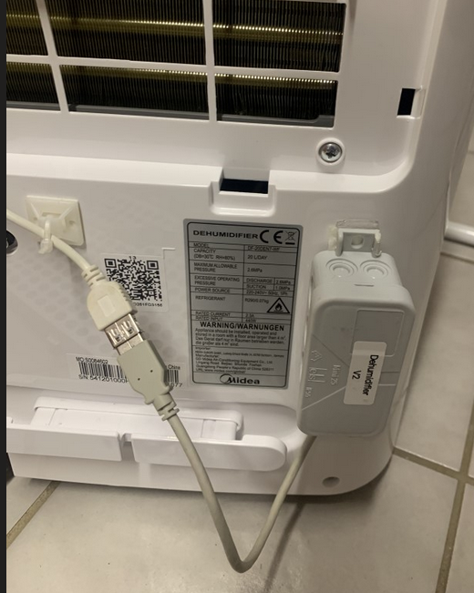

# 1. Project Midea Dehumidifier

## 1.1 Introduction
The Midea DF-20DEN7-WF (and the Comfee MDDF-20DEN7) uses the SmartKey dongle to connect to the cloud-based Midea App.
The Wi-Fi interface is delivered through a dongle named SmartKey that attaches to the Midea controller via USB-A.
This project describes the hardware build and the software to replace the original SmartKey dongle and to expose the functions over MQTT or HTTP REST API.
The project is based on [esp8266-midea-dehumidifier](https://github.com/Hypfer/esp8266-midea-dehumidifier), which provides a C++ implementation.
During the development of this project the [ESPHome-Dehumidifier](https://github.com/Chreece/ESPHome-Dehumidifier) project was created in parallel and offers a similar feature set.

## 2. Fundamentals
### 2.1 Serial Communication
The communication between SmartKey and the Midea controller is serial at 9600 baud 8N1 with 5V TTL levels.

| Parameter | Comment |
| --- | --- |
| Power | ON/OFF |
| Mode | setpoint, continous, smart, dryer |
| Setpoint | 35..85 in steps of 5 % r.h. |
| Fan Speed | low, medium, high |
| Temperature | current temperature in °C |
| Humidity | current relative humidity in % r.h. |
| Error | current error |
| Communicating | communication status (if TRUE the communication is OK) |

## 3. Hardware Replacement
The following hardware components are used:
- ESP32-S3
- 4-channel level shifter 3.3/5.0 V
- cut-off USB-A cable
- USB-A extension
- Wago clamps
- jumper wires
- double-sided tape
- enclosure

The ESP32-S3 provides plenty of RAM so that [TasmoView](https://github.com/wjohn007/TasmoView) can be used.
The 4-channel level shifter adapts the 3.3V signals of the ESP32 to the interface.
It is glued directly onto the ESP32 to save space.
The Wago clamps are also glued to the ESP32 and bridge the USB cable to the electronics.
The USB port of the dehumidifier provides GND,VCC,RX,TX with VCC=5VDC.
The CPU itself serves as a "motherboard" for the level shifter and the Wago clamps.

<br>
So everything fits into a standard small junction box.

<br>
The electrical schematic of the Tasmota controller with all components

<br>
The SmartKey is removed, and the USB extension is attached.

<br>
The USB extension is routed out of the case and connected to the Tasmota controller.

<br>
Completed wiring for the dehumidifier.

## 4. Tasmota Firmware
The standard Tasmota firmware is fully sufficient for the demands of this project.
- [tasmota32s3 without PSRAM usage](https://ota.tasmota.com/tasmota32/release/tasmota32s3.bin)

If more RAM is needed this firmware can also be used with PSRAM.
- [tasmota32s3 with PSRAM usage](https://github.com/Jason2866/Tasmota-specials/raw/refs/heads/firmware/firmware/tasmota32/other/tasmota32s3-qio_opi.bin)

## 5. Application Software
The task is implemented with the Berry programming language.
All source files are packed into the application file dehum.tapp.

What is implemented:
- Implementation of the native communication protocol with the Midea controller
- Provision of the new Tasmota commands
- Integration of the information into the Tasmota sensor message
- Display of the information in the Web UI

Extended functional mode (extended Mode):
- Capture of power consumption via a smart plug (also Tasmota)
- Derivation of the operating state from the electrical power
  - Fan ON/OFF
  - Pump ON/OFF
- Integration of the information into the Tasmota sensor message
- Display of the information in the Web UI
- Display of the information in TasmoView

## 6. Extended Mode System Overview
The following illustration shows the system layout for extended Mode
- The smart plug (3) measures the power consumption of the dehumidifier.
- From this information the following can be derived:
  - Fan is running when power >= 15W
  - Pump is running when power >= 100W

<br>

The communication between the Dehum controller (2) and the smart plug (3) happens via [Udp-Broker](https://github.com/wjohn007/Berry-UdpBroker).

## 7. Parameterization
The user can configure the application parameters with the file ***dehum01.be***.

```py
GPIO_RX = 14   # gpio for serial rx-pin
GPIO_TX = 13   # gpio for serial tx-pin

useExtension = true # if true, use extended mode

```

## 8. Tasmota Commands
| command | arguments | example |
| --- | --- | --- |
| `dhfanSpeed` | `low`, `medium`, `high` | `dhfanspeed medium` |
| `dhmode` | `setpoint`, `continous`, `smart`, `dryer` | `dhmode setpoint` |
| `dhpower` | `on`, `off` | `dhpower on` |
| `dhsetpoint` | `35..85` in steps of 5 | `dhsetpoint 55` |

## 9. Sensor message
### 9.1 Normal Mode
```json
{
  "Time": "2025-12-07T18:34:35",
  "Dehumidifier": {
    "errorString": "no error",
    "communicating": true,
    "operatingmode": "auto",
    "fanspeed": "high",
    "humidity": 56,
    "power": "ON",
    "temperature": 20,
    "setpoint": 55,
    "errorcode": "0",
    "mode": "setpoint"
  }
}
```

### 9.2 Extended Mode
```json
{
  "Time": "2026-01-01T16:41:56",
  "Dehumidifier": {
    "errorString": "no error",
    "communicating": true,
    "operatingmode": "auto",
    "fanspeed": "high",
    "humidity": 42,
    "power": "ON",
    "temperature": 20,
    "setpoint": 55,
    "errorcode": "0",
    "mode": "setpoint"
  },
  "EXTENSION": {
    "FAN_STATE": false,
    "PUMP_STATE": false,
    "Power": 2
  }
}
```

## 10. Tasmota Web-UI
### 10.1 Default Mode
<br>

### 10.2 Extended Mode
<br>

### 10.3 TasmoView
<br>
<p></p>
<br>

## 11. References
[esp8266-midea-dehumidifier](https://github.com/Hypfer/esp8266-midea-dehumidifier)
[ESPHome-Dehumidifier](https://github.com/Chreece/ESPHome-Dehumidifier)
[TasmoView](https://github.com/wjohn007/TasmoView)
[Berry-UdpBroker](https://github.com/wjohn007/Berry-UdpBroker)
